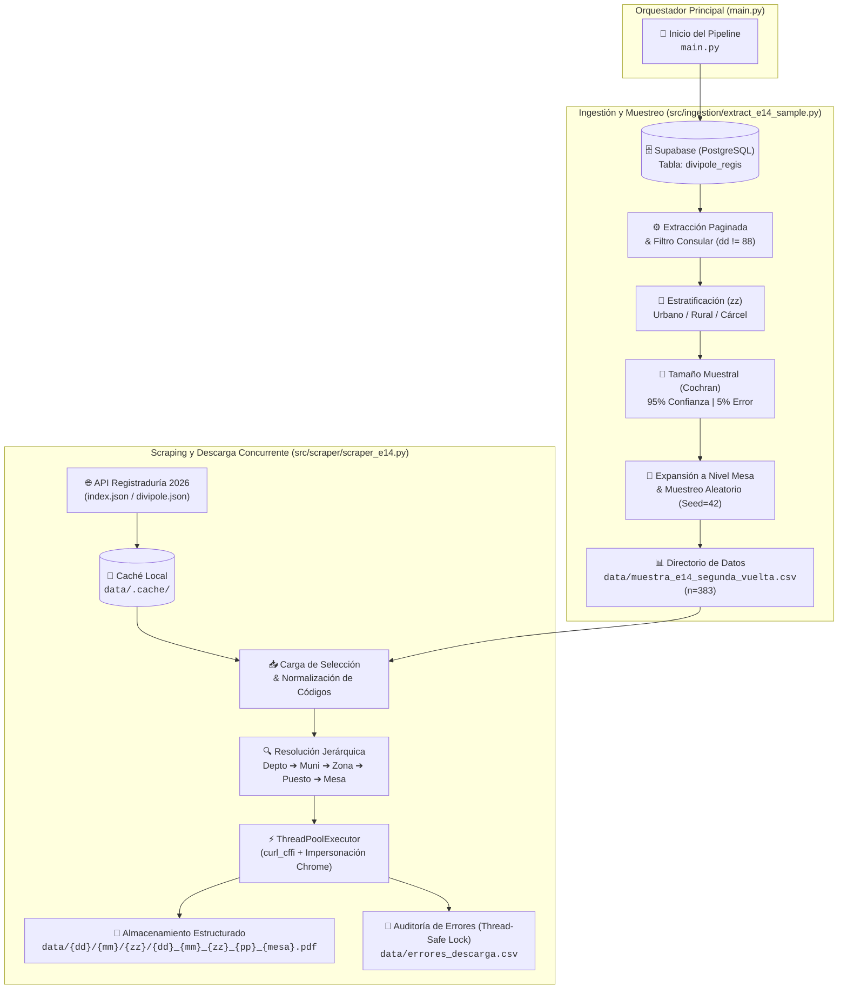

# E-14 Document AI & ETL Pipeline | Fase 1: Ingestión, Muestreo Estratificado y Scraping Asíncrono

Pipeline modular de ingeniería de datos y diseño experimental desarrollado para la digitalización automatizada y extracción de datos mediante Visión por Computadora OCR (Optical Character Recognition) y HTR (Handwritten Text Recognition) de formularios electorales E-14 (Segunda Vuelta Presidencial 2026, Colombia).

Este repositorio (por ahora) implementa la **Fase 1** que corresponde a la extracción de datos maestros desde PostgreSQL, muestreo probabilístico estratificado ($n = 383$) y un motor de web scraping concurrente y dirigido.

---

## 1. Arquitectura del Flujo de Datos




---

## 2. Componentes del Sistema

### Módulo de Ingestión y Muestreo (`src/ingestion/`)
* **Persistencia Relacional:** Conexión paginada contra **Supabase (PostgreSQL)** sobre la tabla `divipole_regis`; esta tabla fue generada a partir de un PDF oficial de la registraduria **[divipole_definitiva_2026.pdf](https://www.registraduria.gov.co/IMG/pdf/divipole_definitiva_2026.pdf)**, que fue previamente convertido de formato PDF a Excel con la herramienta online de **[Adobe Acrobat](https://acrobat.adobe.com/link/acrobat/pdf-to-excel/)** y posteriormente subida a Supabase en formato csv para la generacion automatica de dicha tabla `divipole_regis`.
* **Delimitación del Universo:** Filtrado estricto de mesas que no se encontraron en (https://escrutinios2vueltapresidente2026.registraduria.gov.co/actas-e14), para este caso consulares (`dd == '88'`), esto con el fin de garantizar la trazabilidad del dataset frente a datos de auditoría oficiales.
  * **Puestos procesados:** 13.489
  * **Universo estadístico ($N$):** 118.346 mesas.
* **Diseño Experimental (Fórmula de Cochran):**
  Cálculo del tamaño muestral para poblaciones finitas bajo varianza máxima ($p = q = 0.5$):

$$n = \frac{N \cdot Z^2 \cdot p \cdot q}{e^2 \cdot (N - 1) + Z^2 \cdot p \cdot q}$$

  * $Z = 1.96$ ($95\%$ Confianza)
  * $e = 0.05$ ($5\%$ Margen de Error)
  * **Tamaño muestral resultante:** $n = 383\text{ mesas}$

* **Estratificación Proporcional:**
  Distribución controlada por código de zona (`zz`):

| Estrato Operativo | Código Zona (`zz`) | Total Mesas ($N_i$) | Representatividad | Muestra ($n_i$) |
| :--- | :--- | :--- | :--- | :--- |
| **Urbano** | `00` a `97` | 98.819 | 83.50% | **319** |
| **Rural** | `99` | 19.365 | 16.36% | **63** |
| **Penitenciario** | `98` | 162 | 0.14% | **1** |
| **Total** | — | **118.346** | **100.0%** | **383** |

* **Extracción Aleatoria:** Muestreo Aleatorio Simple (MAS) sin reemplazo dentro de cada estrato fijando semilla (`SEED=42`) para garantizar reproducibilidad.

---

### Módulo de Scraping Asíncrono Dirigido (`src/scraper/`)
* **Extracción Dirigida:** Ingestión exclusiva de las actas requeridas en `muestra_e14_segunda_vuelta.csv`, evitando transferencias masivas redundantes.
* **Resiliencia de Red y Evasión TLS:** Uso de `curl_cffi` con impersonación de huella digital del navegador (`chrome110`) y *jitter* aleatorio para evitar bloqueos por tasa de peticiones (*rate limiting*).
* **Caché Estructural:** Almacenamiento local de esquemas JSON intermedios (`.cache/`) para permitir reejecuciones idempotentes y descargas incrementales.
* **Validación de Integridad:** Comprobación binaria de cabeceras (`%PDF`) en la respuesta HTTP antes del guardado en disco.
* **Auditoría Thread-Safe:** Registro sincronizado con `threading.Lock` en `errores_descarga.csv` ante inconsistencias de índices o fallos de red.

---

### Demostración Interactiva (`notebooks/`)

Para auditar y visualizar la ejecución paso a paso de este pipeline sin necesidad de clonar el repositorio, instalar dependencias ni configurar credenciales de Supabase, consulta el notebook interactivo con **salidas y logs pre-renderizados**:

**[`notebooks/01_extract_sample.ipynb`](notebooks/01_extract_sample.ipynb)** *(o abre directamente en GitHub)*

#### Contenido y Resultados Auditables en el Notebook:

1. **Ingestión desde Supabase:**
   * Extracción paginada de **13.742 puestos** de votación de la base de datos DIVIPOLE.
   * Filtro y saneamiento: Exclusión de consulados (`dd = '88'`), consolidando un universo doméstico de **118.346 mesas**.
2. **Estratificación y Cálculo Muestral:**
   * Clasificación de zonas operativas mediante codificación oficial `zz` (`urbano`, `rural`, `carcel`).
   * Aplicación de la fórmula de **Cochran para poblaciones finitas** ($N = 118.346$, Confianza 95%, Margen de error $\pm 5\%$), determinando $n = 383$.
   * Asignación proporcional de cuotas:
     * **Urbano:** 319 mesas (83.50%)
     * **Rural:** 63 mesas (16.36%)
     * **Cárcel:** 1 mesa (0.14%)
3. **Muestreo Atómico y Persistencia:**
   * Expansión del marco muestral desde nivel puesto a nivel atómico de mesa individual y muestreo aleatorio reproducible (`random_state=42`).
   * Exportación del contrato de datos a `data/muestra_e14_segunda_vuelta.csv`.
4. **Scraping y Descarga Concurrente:**
   * Resolución del árbol jerárquico JSON contra los endpoints oficiales de la Registraduría.
   * Ejecución multihilo (`ThreadPoolExecutor`) con validación de cabecera binaria `%PDF` y persistencia en disco.

---

## 3. Estructura del Repositorio

```text
e14-vision-ocr-pipeline/
├── data/
│   ├── divipole_2026.csv                   # Estructura maestra nacional
│   └── muestra_e14_segunda_vuelta.csv      # Muestra probabilística n=383
├── notebooks/
│   ├── .env
│   ├── 01_extract_sample.ipynb             # Demostración interactiva
│   └── e14_vision_ocr_pipeline.ipynb       # (En curso) Pipeline de visión artificial y OCR
├── src/
│   ├── __init__.py
│   ├── ingestion/
│   │   ├── __init__.py
│   │   └── extract_e14_sample.py       # Lógica de muestreo y conexión Supabase
│   ├── scraper/
│   │   ├── __init__.py
│   │   └── scraper_e14.py                  # Scraper asíncrono y auditoría
│   └── processing/
│       ├── __init__.py
│       ├── preprocess.py                   # (En curso)Homografía y rectificación
│       ├── tools.py                        # (En curso)Segmentación de ROI
│       ├── ocr.py                          # (En curso)Inferencia OCR / HTR
│       └── view.py                         # (En curso)Visualización de crops
├── .env
├── .gitignore
├── main.py                                 # Ejecución de pipeline end-to-end
├── pyproject.toml
├── README.md
└── requirements.txt
```
---

## 4. Instalación y Ejecución

### 4.1. Clonar el repositorio y configurar el entorno

    git clone [https://github.com/tu-usuario/e14-vision-ocr-pipeline.git](https://github.com/tu-usuario/e14-vision-ocr-pipeline.git)
    cd e14-vision-ocr-pipeline
    python -m venv .venv
    source .venv/bin/activate   # En Windows: .venv\Scripts\activate
    pip install -r requirements.txt (Se cargaron dos archivos)
    pip install -e .

### 4.2. Configurar variables de entorno
Previamente cargada una tabla en supabase con el nombre de divipole_regis con 
la data que esta en "..\data\divipole_2026.csv"
Crea un archivo .env en la raíz a partir de la plantilla:
    
    SUPABASE_URL="[https://tu-proyecto.supabase.co](https://tu-proyecto.supabase.co)"
    SUPABASE_KEY="tu-key"

### 4.3. Ejecución del Pipeline
    Ejecución del pipeline completo de Fase 1 (Generación de muestra y descarga dirigida de PDFs):

    python main.py

